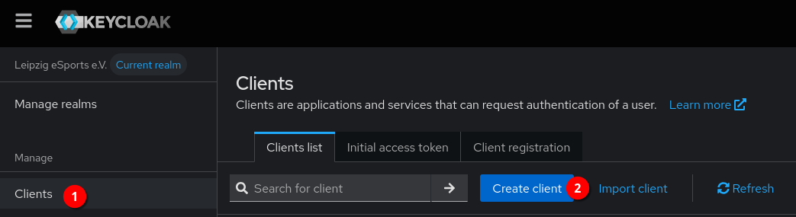
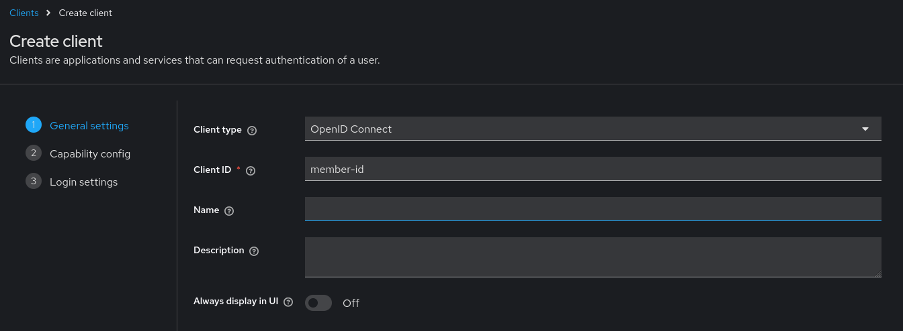
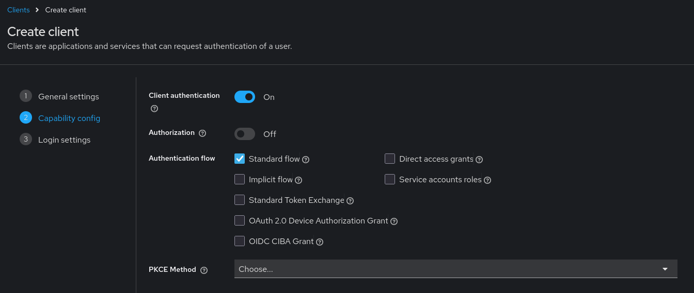
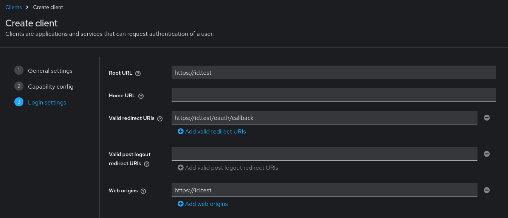
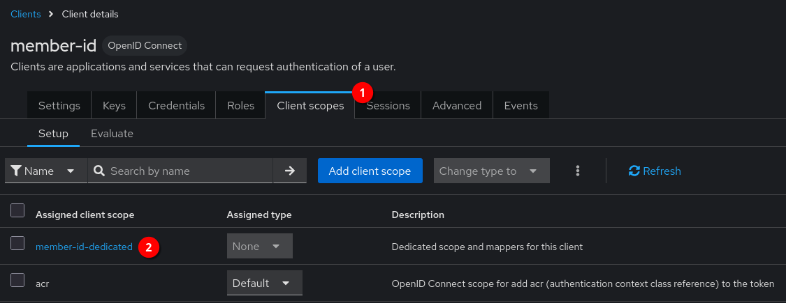
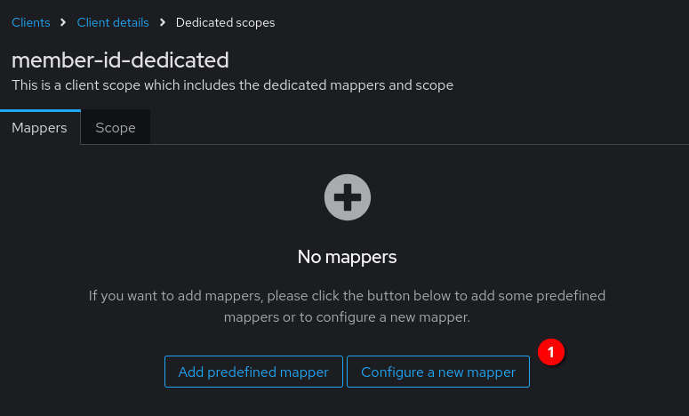
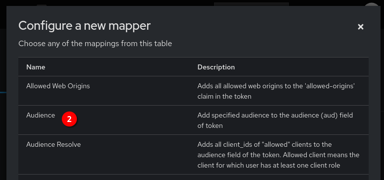
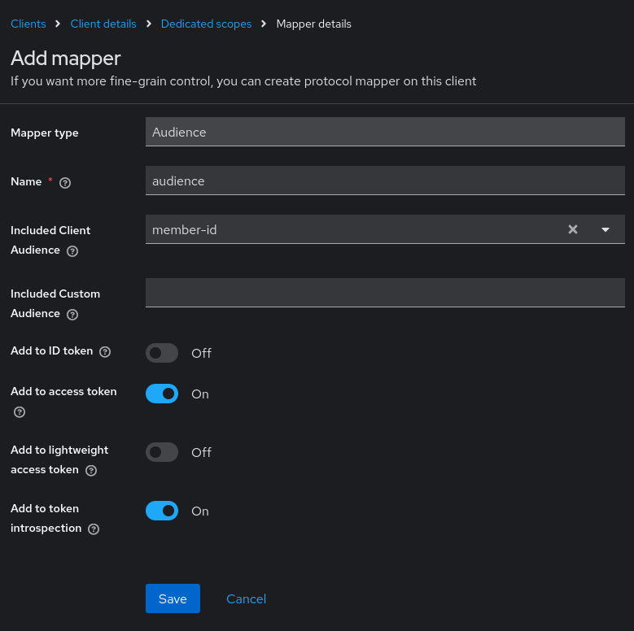
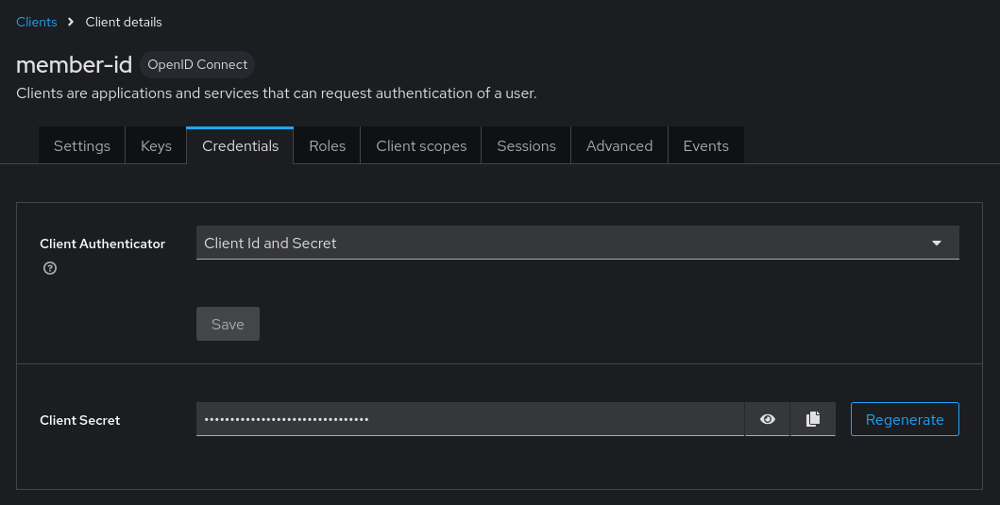

This repository contains a Go application that provides a server which issues digital IDs for members of Leipzig eSports e.V.

# Installation

The application is shipped as a container image. It can be pulled with the following command.

```
docker pull ghcr.io/leipzigesports/les-member-id:latest
```

Alternatively, you can build the application with Go.

```shell
go build -v -o member-id .
```

# Configuration

The application can be configured using CLI parameters, environment variables and YAML files.
To obtain an overview of all parameters, run the following command.

```shell
./member-id help run
```

A [minimal](config.minimal.yaml) and a [full configuration example](config.full.yaml) using YAML with all default values is provided in the root of this repository. 

## Setting up a Keycloak client

Navigate to _Clients_ in your realm and click on _Create client_.



Set a new name for your client and select _OpenID Connect_ as the client type. 
Click _Next_.



Select _Client authentication_. 
Keep all other settings as they are.
Click _Next_.



Set _Root URL_ and _Web origins_ to the full URL where you will run the service.
Set _Valid redirect URIs_ to the same URL, but add `/oauth/callback` to the end of the URL.
Click on _Save_.



Locate the dedicated scopes of your newly created client by clicking on the _Client scopes_ tab and clicking on the first entry in the list.



Click on _Configure a new mapper_, then select _Audience_ from the list of scopes.





Enter "audience" in the _Name_ field.
Select the name of your client from the list for _Included Client Audience_.
Leave all other settings as they are and click on _Save_.



Navigate back to your client.
Click on the _Credentials_ tab.
Copy the _Client Secret_.
This, along with the name of your client as the client ID, are part of your OAuth settings to make this application work.



# License

Apache 2.0
